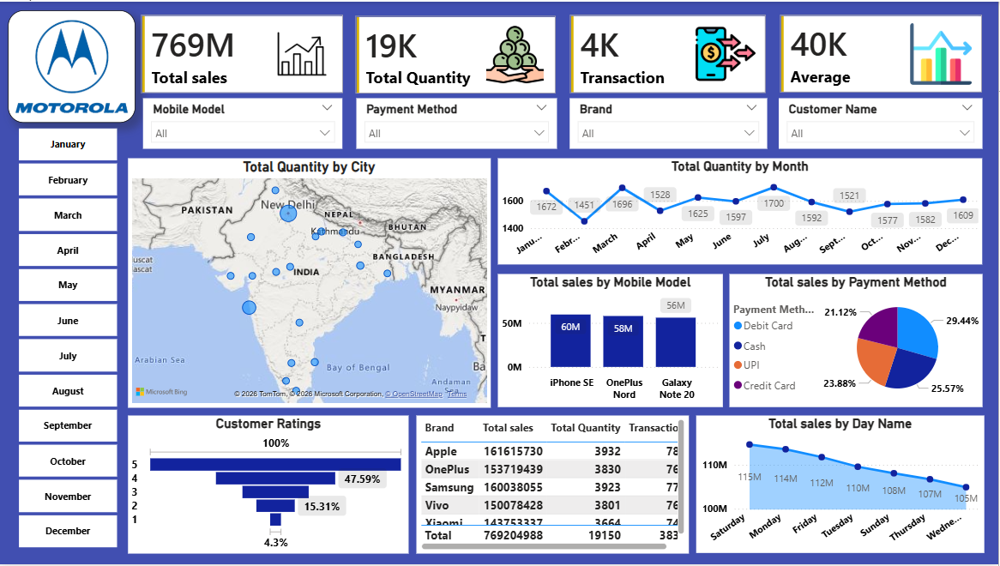

# Motorola Sales Analysis Dashboard

## Project Overview

This project is an interactive Power BI dashboard built using Motorola mobile sales data. The dashboard provides comprehensive insights into sales performance, customer purchasing behavior, product popularity, payment preferences, and regional sales distribution.

The goal of this project is to transform raw sales data into meaningful business intelligence that helps stakeholders monitor performance, identify trends, and make data-driven decisions.

---

## Dashboard Features

### Key Performance Indicators (KPIs)

* **Total Sales:** 769M
* **Total Quantity Sold:** 19K
* **Total Transactions:** 4K
* **Average Sales Value:** 40K

These KPIs provide a quick overview of overall business performance.

---

## Visualizations Included

### 1. City-wise Sales Distribution

* Interactive map visualization displaying sales quantity across different cities.
* Helps identify high-performing and low-performing regions.
* Enables geographical sales analysis.

### 2. Monthly Sales Trend Analysis

* Line chart showing total quantity sold by month.
* Identifies seasonal trends and monthly performance variations.
* Supports demand forecasting and planning.

### 3. Mobile Model Performance

* Bar chart comparing sales across different Motorola mobile models.
* Highlights best-selling products.
* Helps understand product demand and market preferences.

### 4. Payment Method Analysis

* Pie chart showing sales distribution by payment method:

  * Debit Card
  * Credit Card
  * Cash
  * UPI
* Provides insights into customer payment preferences.

### 5. Customer Rating Analysis

* Rating distribution chart displaying customer feedback from 1 to 5 stars.
* Helps measure customer satisfaction and product acceptance.

### 6. Brand Performance Analysis

* Detailed table displaying:

  * Brand Name
  * Total Sales
  * Total Quantity Sold
  * Total Transactions
* Enables comparison of performance across different mobile brands.

### 7. Day-wise Sales Analysis

* Line chart representing total sales by day of the week.
* Identifies peak sales days and customer purchasing patterns.

### 8. Dynamic Filters

Interactive slicers available for:

* Mobile Model
* Payment Method
* Brand
* Customer Name
* Month Selection

These filters allow users to explore data from multiple perspectives.

---

## Tools & Technologies Used

* Power BI Desktop
* DAX (Data Analysis Expressions)
* Power Query
* Data Cleaning & Transformation
* Data Modeling
* Microsoft Bing Maps

---

## Business Insights

* Identify top-selling mobile models.
* Analyze customer purchasing behavior.
* Track sales trends across months and weekdays.
* Understand payment method preferences.
* Monitor customer satisfaction through ratings.
* Compare brand-wise sales performance.
* Discover high-performing cities and regions.
* Support strategic business decision-making through data visualization.

---

## Dashboard Preview

---

## How to Use

1. Open the `.pbix` file in Power BI Desktop.
2. Use the available slicers and filters to customize analysis.
3. Explore sales trends, customer insights, and regional performance through interactive visualizations.
4. Drill down into specific brands, models, payment methods, or months for deeper analysis.

---

## Future Improvements

* Add profit and revenue margin analysis.
* Include customer segmentation insights.
* Implement sales forecasting using predictive analytics.
* Add year-over-year growth comparisons.
* Improve mobile and tablet dashboard responsiveness.
* Integrate real-time sales data sources.

---

## Author

**MARIYAM Y. SIDAT**
Data Analyst | Power BI Developer

---
